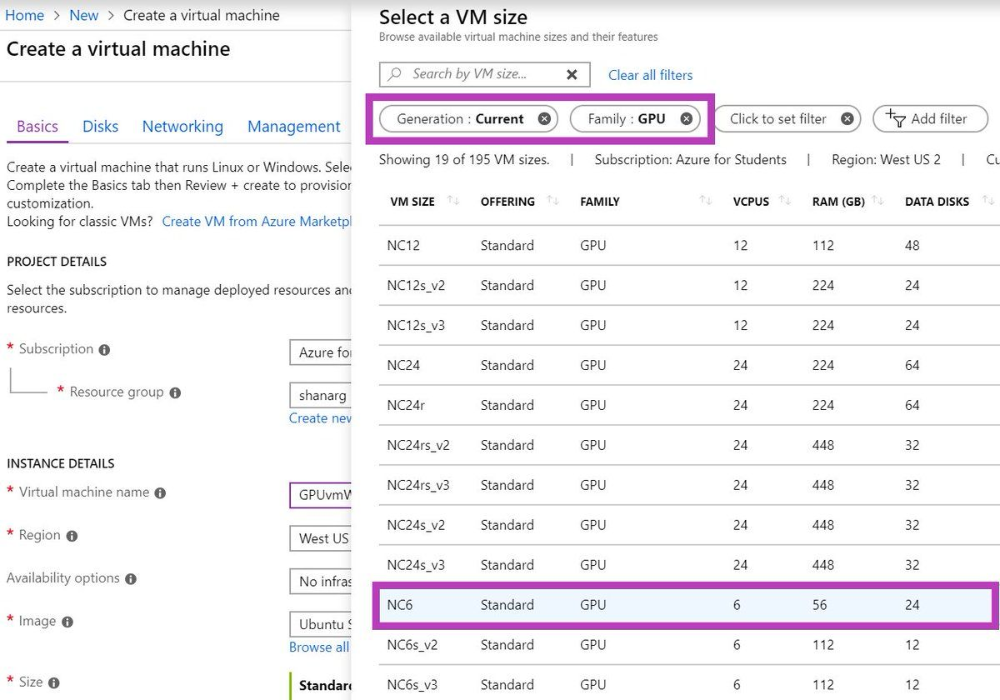

# Azure Setup

## Table of contents

1. [Introduction](#introduction)
2. [Sign up for Azure](#sign-up-for-azure)
3. [Set Up VM Image](#set-up-vm-image)
4. [Manage Your VM](#manage-your-vm)
4. [Development Options using your VM](#development-options-using-your-vm)
    1. [Work in VSCode connected to your VM](#option-1-work-in-vscode-connected-to-your-vm)
    2. [Work in JupyterLab](#option-2-work-in-jupyterlab)
    3. [Work locally and sync via GitHub](#option-3-work-locally-and-sync-via-github)
8. [Other Tips](#other-tips)  
9. [Further Training](#further-training)
    

## Introduction

One option for your team projects and your individual project is to use a GPU instance on Microsoft Azure. 

### Azure versus Colab

While [Colab](https://research.google.com/colaboratory/faq.html) is useful for your module projects and for the experimentation phase of your individual course project, there are a few reasons you will likely want to use Azure or another cloud platform rather than Colab for your course project:  
 1) Colab is not designed to deploy code into production.  Since you are required to develop an interface for your course project, Colab will not be able to support your production app.  Note: you may be able to train your model on Colab and deploy on something else like Heroku.  
 2) You may find that you need a dedicated GPU instance to train on large datasets for your course project, and perhaps for your module projects as well (depending on what data you are using).  Colab will disconnect after 12 hours or ~30 min of idling (and you will lose your unsaved data). A Azure VM instance will not disconnect untill you stop it (or run out of credits).  Azure also allows you to choose the type and number of GPUs to use, while Colab does not.
 3) A Azure VM instance's disk space allows you to deal with larger datasets. In Colab's case, you will have to save all your data and models to Google Drive.

## Sign Up for Azure
Azure provides $100 free credits to verified students when you sign up using your university email address.  The first step is to sign up for [Azure for Students](https://signup.azure.com/studentverification?offerType=1&correlationId=2279b21a2f344b4a9b51ab1b5b6ba481).  Select your Duke account and then log in with your NetID.  Complete the 'About You' page and then enter your phone number in the 'Identity verification by phone' screen.  Review the agreement and hit 'sign up'.  

[This tutorial video](https://www.youtube.com/watch?v=XLxqbEsJ7_I) walks you through the step by step process to set up your Azure for Students account.

## Set Up VM Image
To do ML on a GPU-enabled VM on Azure, we will set up a Azure **Data Science Virtual Machine (DSVM**).  Azure offers two methods of running deep learning: setting up your own customized VM image for deep learning, or using the managed AzureML platform.  You can read a [comparision of the two options here](https://docs.microsoft.com/en-us/azure/machine-learning/data-science-virtual-machine/overview).  In this guide we are going to set up a DSVM image.

Follow the [DSVM quickstart guide](https://docs.microsoft.com/en-us/azure/machine-learning/data-science-virtual-machine/dsvm-ubuntu-intro) to set up your VM.

Azure for Students accounts come with GPU quota by default, so we do not need to go through a process to request GPU quota in order to set up a GPU-enabled VM for deep learning (as we do with GCP and AWS).  You will however have to put in a credit card, which will be charged if you use up your $100 free credits.

The list of GPU=enabled VM sizes is available [here](https://docs.microsoft.com/en-us/azure/virtual-machines/sizes-gpu).  It is recommended to set up one of the lowest-cost options, a NC6 or a NC4as T4 v3, to maximize your free credits.  The hourly pricing for each VM type can be found [here](https://azure.microsoft.com/en-us/pricing/details/machine-learning/#pricing).



## Manage your VM
You can start and stop your VM instance from the Azure Portal or by using the Azure CLI on the command line.

To start an instance from the command line run: 
```
az vm start --resource-group <resource-group-name> --name <vm-name>
```
To stop a running instance via the CLI run:
```
az vm deallocate --resource-group <resource-group-name> --name <vm-name>
```

**IMPORTANT NOTE:** in Azure there is a difference between "stopping" and "deallocating" an instance.  Stopping an instance terminates all running processes on the VM but it does not release the attached resources, meaning you continue to pay the hourly rate.  Deallocating an instance stops the processes and detaches the resources, so you will not pay the hourly rate until you re-start the instance.

Here is a [cheat sheet of common Azure CLI commands](https://docs.microsoft.com/en-us/azure/virtual-machines/linux/cli-manage).

## Development Options using your VM
There are several different ways to use your new VM as part of your development workflow.  Here are a few possibilities:

### Option 1: Work in VSCode connected to your VM
One of the nice things about Azure is that if you are a VS Code user, you can use your VS Code on your computer and remote connect via SSH to your VM to develop and run code on your VM, through your VS Code interface on your computer.

To develop on your VM using VS Code, follow the [Remote development over SSH tutorial](https://code.visualstudio.com/docs/remote/ssh-tutorial). Additionally, watch the [tutorial video](https://learning.oreilly.com/videos/azure-remote-compute/50126VIDEOPAIML/) on how to connect your Azure VM up to VSCode by Microsoft's Alfredo Deza (Duke students use your Duke credentials to log into O'Reilly).

**If you chose to work using the VM, be aware that you will be charged credits for the time your VM is running - regarless of whether you are training a model or just developing.** 

### Option 2: Work in JupyterLab
You can also use JupyterLab on your VM, which provides access to run Jupyter Notebooks, a Python file editor, and terminal access. To work in JupyterLab, follow the instructions [here](https://code.visualstudio.com/docs/remote/ssh-tutorial).

**If you chose to work using the VM, be aware that you will be charged credits for the time your VM is running - regarless of whether you are training a model or just developing.** 

### Option 3: Work locally and sync via GitHub
Alternatively, you can develop locally on your favorite editor, push to your repo on Github, and pull on the remote server using terminal or via JupyterLab (or copy the files to the remote server per the above instructions, but a better practice is to use GitHub for version control).

The benefit of this option is that you are not charged credits for working time (until you need to train your model), or run the risk of forgetting to turn your instance off when you step away from my computer.  The downside of this is the extra step of syncing your work via GitHub to the VM, and also that you will not be able to train your model from your local development environment and will need to switch over to your VM to train when ready (assuming it requires GPU).  You may also not be able to access your data while developing, if it resides on GCP unless you maintain a local copy as well.

## Other Tips
1) ### REMINDER: Make sure you stop your instances!
    Don't forget to stop your instance when you are done. You can restart your instance and your saved files will still be available.  You can stop your instance using the Azure Portal or on the command line using the CLI: 
    ```
    az vm deallocate --resource-group <resource-group-name> --name <vm-name>
    ```


## Further Training
- [Intro to Azure session by Microsoft's Alfredo Deza](https://duke.zoom.us/rec/play/rBr7_1y3VOxhp54LwM1aylPzcexMHr3Z83HDLbpPWrNdH5uHP6dBwulvyHgFMtiLonscdX9FQDtCd3kC.EzLULTyThz3GUpmd?continueMode=true&_x_zm_rtaid=kT4qo1VkS9akVqxg6Jr1Ew.1641172555387.fc9bc47a0470452208ff8baa8f3833ec&_x_zm_rhtaid=636)  
    - 1hr intro session presented to students in AIPI 520 
- [Azure remote compute tutorial video](https://learning.oreilly.com/videos/azure-remote-compute/50126VIDEOPAIML/)  
    - Video walk-through of how to connect your local VSCode to run on an Azure VM via SSH
- [Learning Journey for Machine Learning on Azure](https://azure.microsoft.com/mediahandler/files/resourcefiles/ml-learning-journey/Learning%20Journey%20for%20Machine%20Learning%20on%20Azure%20-%2020210208.pdf)  
    - A free 1hr/day 30-day training program to learn ML on Azure, which can also prepare you for the Azure Data Scientist Associate certification  
- [Microsoft Azure AI Fundamentals Specialization on Coursera](https://www.coursera.org/specializations/microsoft-azure-ai-900-ai-fundamentals)  
    - Series of 5 courses to learn the fundamentals of AI on Azure and prepare for the AI-900 Microsoft Azure AI Fundamentals certification exam