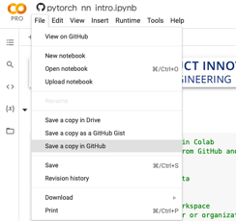

# Google Colaboratory (Colab) Pro Quickstart Guide

## Table of contents

1. [Introduction](#introduction)
2. [Recommended Workflow](#recommended-workflow)
3. [Other Tips](#other-tips)

## Introduction

Google Colaboratory (Colab) is a cloud-based Jupyter Notebook environment that runs in your browser.  Colab allows you to edit and run Jupyter Notebooks on a cloud VM rather than your own computer.  For purposes of this class, we will be using Colab Pro, which offers greater access to GPU instances to support model training.  Colab Pro costs $10/month.  

We recommend using Colab Pro for running the demo notebooks provided in class and for exploration work.  Relative to the other cloud platform options, it is a very affordable option and has no risk of forgetting to turn an instance off and overspending, as the monthly fee is fixed regardless of how much compute resources you use.

There are a couple downsides to be aware of in using Google Colab relative to one of the full cloud platforms e.g. GCP:  
1) It is designed for editing and execution of code notebook files, rather than Python scripts, and so it does not provide access to a fully functioning IDE for Python development.  However, Colab does provide access to a terminal to run you code.  This means that you could develop locally, push your code to Colab via GitHub or save it on Google Drive, and then run it via terminal from Colab using GPU.
2) Colab itself does not provide persistent storage as a cloud platform does.  Each time you open Colab it opens a new VM instance, meaning you cannot store data/code in Colab itself.  Instead, you will need to save your code and data in GitHub and/or Google Drive and then access it from Colab.  
3) Colab is not designed to be a production environment for deploying applications.  You may want to use it for early-stage exploratory development but you will eventually need to use a full cloud platform (or something like Heroku) when you are ready to deploy your app.

## Recommended Workflow
The below steps provide a recommended workflow for a new project which will utilize Colab.

1) If you are starting a new project:
    1) Create your project directory locally on your computer and add any existing files (notebooks, readme etc)
    2) [Create a GitHub repo for the project](https://docs.github.com/en/github/importing-your-projects-to-github/importing-source-code-to-github/adding-an-existing-project-to-github-using-the-command-line#adding-a-project-to-github-without-github-cli) and initialize it with your local structure and content. 
2) Open your notebook in Colab to run it by going to [colab.research.google.com](colab.research.google.com).  You can upload a notebook stored on your computer to Colab to run, but if your notebook is already in GitHub, click on the GitHub tab and then search for the repo and notebook you want to run.

    

3) Load any other files from your GitHub repo (e.g. Python scripts, data) into Colab's temporary storage working directory by adding code to the top of your notebook (or use the terminal access provided by Colab).  Select your scenario below and add the appropriate code:

    1) **SCENARIO A**: You are using a public repo and do not need to edit any files other than the notebook file itself.  

        ```
        import os
        # Remove Colab default sample_data
        !rm -r ./sample_data

        # Clone GitHub files to colab workspace
        git_path = 'https://github.com/AIPI540/class_demos.git' # Enter repo url
        !git clone "{git_path}"

        # Change working directory to location of notebook
        notebook_dir = 'nn_basics'
        path_to_notebook = os.path.join(repo_name,notebook_dir)
        %cd "{path_to_notebook}"
        %ls
        ```


    2) **SCENARIO B**: You are using a private repo OR you are using a public repo but need to add or edit files in the repo other than the notebook file (e.g. you want to edit python scripts or save additional data).  Add the below code to the top cell of your notebook and run it.  Be sure to replace the GitHub username, email address, and repo name with your own.  Note: when you run the below you will be prompted to authenticate with GitHub by entering your [GitHub token](https://docs.github.com/en/authentication/keeping-your-account-and-data-secure/creating-a-personal-access-token).

        ```
        import os
        import getpass

        # Remove Colab default sample_data
        !rm -r ./sample_data

        # Clone GitHub files to colab workspace
        git_user = "AIPI540" # Enter user or organization name
        git_email = "jon.reifschneider@gmail.com" # Enter your email
        repo_name = "class_demos" # Enter repo name
        git_token = getpass.getpass("enter git token") # Enter your github token 
        git_path = f"https://{git_token}@github.com/{git_user}/{repo_name}.git"
        !git clone "{git_path}"

        # Change working directory to location of notebook
        notebook_dir = 'nn_basics'
        path_to_notebook = os.path.join(repo_name,notebook_dir)
        %cd "{path_to_notebook}"
        %ls
        ```

4) If you need access to larger data that cannot be stored on GitHub, one good option is to store it on Google Drive.  You can then mount your Google Drive account in Colab by running the following in your notebook.  Make sure to change the "path_to_gdrive_files" to the path in your google Drive where your files are located (note: the path always begins with '../../gdrive/MyDrive/' and then you specify the exact path within Google Drive after that)

        # Mount Google drive to access files there
        from google.colab import drive
        drive.mount('/content/gdrive')
        # Path to files in Google Drive
        path_to_gdrive_files = '../../gdrive/MyDrive/AIPI540/class_demos/colab_example'
        # Display contents
        print('Contents of gdrive directory:')
        print(os.listdir(path_to_gdrive_files))

5) When you are ready to run your code to train your model, switch to GPU.  Click **Runtime** -> **Change Runtime Type** and select "GPU" for Hardware Accelerator.  Make sure to switch back to CPU when you are done with GPU training - Colab prioritizes allocation of GPU capacity to those users who have used it less, so if you heave it on too long you may find that your future access will begin to become limited as Google allocates capacity to others over you.

    

6) If you need to push new or edited files back to your GitHub repo (other than your notebook file itself- see next step for pushing your notebook), add the following at the end of your notebook and run it when ready to push your files back to GitHub.  Make sure to change the user name and email to your own.

    ```
    git_user = "AIPI540" # Enter user or organization name
    git_email = "jon.reifschneider@gmail.com" # Enter your email
    !git config --global user.email "{git_email}"
    !git config --global user.name "{git_user}"
    !git add --all #List files here that you have added or changed
    !git commit -m "updated from colab"
    !git push
    ```
7) Save your edited Colab notebook by pushing it back to your GitHub repo (even if you do step 6 above, since that will not push your new notebook - you need to do it manually).  Go to **File** -> **Save a Copy in GitHub** to push it back to your repo.

    

## Other Tips  
1) The GPU resources Colab provides are not unlimited.  Additionally, they prioritize access to those who have used less recently.  Therefore, you want to use GPU only when you need it, and avoid leaving it on when you are not using it.  A good practice is to use no hardware acceleration while you are coding, and only enable GPU when you are ready to run your code and train your model.  Be sure to then disable it afterward.  Additionally, remember to close your Colab broswer tabs when you are done work.

2) Colab comes pre-installed with a number of data science packages, but you can also easily install additional libraries using pip install.  For example, to install and import the Cartopy package run the following.  Since Colab starts a new VM each time you open it, next time you work in Colab you will need to re-install the package on the VM.
    ```
    !pip install cartopy
    import cartopy
    ```

3) You can also import your own classes and functions from Python scripts to use in your notebook run file.  To import contents from scripts you have already loaded into the Colab temporary storage (following the above instructions), run something like the following:
    ```
    from jons-custom-module import Jon
    ```
    
4) If you have made a mistake in loading files or importing modules, you can reset everything back to a fresh VM by clicking **Runtime** -> **Factory reset runtime**